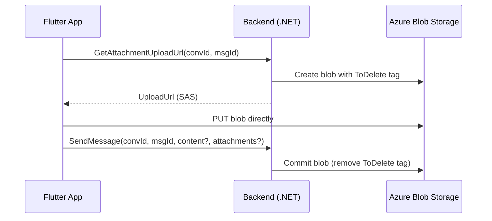
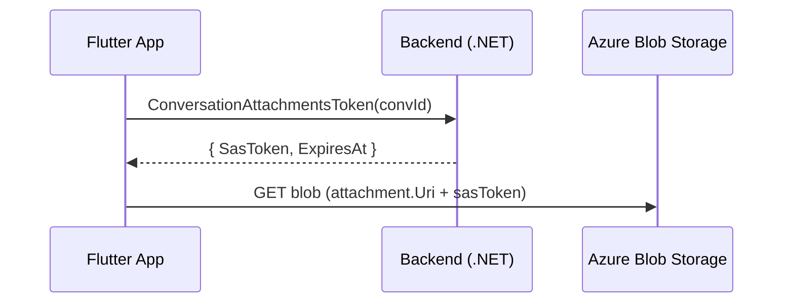

# ADR-001: Chat Attachments Architecture

_Design for supporting image, video, and file attachments in the chat system_

## Status

**Proposed** (2026-01-05)

**Author**: Łukasz Garstecki

## Context

### Problem Statement

The LeanCode Chat library currently supports only text messages. Users need the ability to send images, videos, and potentially other file types within conversations. This requires decisions about:

- File storage infrastructure
- Upload and download flows
- Security and access control
- Data model changes
- Mobile client integration

### Business Context

- The chat library is a reusable package used across multiple projects
- Most consumers of this package already have Azure Blob Storage infrastructure
- The solution should integrate with existing authentication patterns (Entra ID)
- Initial version should be simple, with room for future enhancements (thumbnails, compression)

### Options Considered

#### Storage Solutions

| Option | Pros | Cons |
|--------|------|------|
| **Azure Blob Storage** | Scalable, native Azure integration, CDN support, existing infrastructure in most projects | Additional Azure dependency |
| Firestore (Base64) | Simple, everything in one place | 1MB document limit, inefficient for large files |

**Decision: Azure Blob Storage** - leverages existing infrastructure and scales well for large video files (tens of MB).

#### Container Structure

| Option | Pros | Cons |
|--------|------|------|
| Single container with folder structure | Simple, one container to manage | SAS tokens cannot be scoped to folder prefix without HNS |
| **Container per conversation** | Natural SAS scoping, easy cleanup (delete container = delete all attachments) | More containers to manage |
| Separate containers by file type | Different retention policies per type | Complex, no security benefit |

**Decision: Container per conversation** - enables container-level SAS tokens that naturally scope access to a single conversation without requiring Hierarchical Namespace.

#### SAS Token Strategy

| Option | Pros | Cons |
|--------|------|------|
| Per-file SAS (on-demand) | Most secure, granular control | API call for every file |
| Per-conversation SAS (stored in Firestore) | Auto-sync to clients | Token expiration handling, visible to all members |
| **Per-conversation SAS (via API endpoint)** | Clean separation, no storage of secrets | Requires API call when accessing conversation |
| Hierarchical Namespace directory SAS | True prefix scoping | Requires HNS-enabled storage account |

**Decision: Per-conversation SAS via dedicated API endpoint**
- Upload: Per-blob SAS URL (write permission)
- Download: Per-container SAS token (read permission, 24h validity)

#### Upload Flow

| Option | Pros | Cons |
|--------|------|------|
| **Direct upload to Azure (client → storage)** | No backend bottleneck, supports large files, progress indication | Requires signed URLs |
| Upload through backend | Simpler client, full control | Backend becomes bottleneck, timeout issues for large files |

**Decision: Direct upload with backend-generated SAS URLs**
1. Client requests upload URL from backend
2. Backend creates container (if needed), generates SAS URL with write permission
3. Client uploads directly to Azure Blob Storage
4. Client sends message with attachment reference

#### Message Model Extension

| Option | Pros | Cons |
|--------|------|------|
| **Extend `SendMessage` contract** | Single contract, text+attachments in one message | Validation logic change |
| New `SendMessageWithAttachments` contract | Clean separation | Two contracts to maintain, no text+attachments combo |
| Separate attachment command | Maximum flexibility | More complex flow, ordering issues |

**Decision: Extend `SendMessage` contract** - supports text-only, attachments-only, or text+attachments in a single message. Simpler API surface.

### Out of Scope for v1

- Server-side compression/optimization
- Video thumbnails generation
- Message/attachment deletion
- Offline support for media
- File type validation (trust client)
- File size limits

## Decision

### Architecture Overview

#### Upload Flow



#### Download Flow



### Storage Structure

```
Azure Blob Storage Account
├── chat-{conversationId1}/           # Container per conversation
│   ├── {messageId1}/{guid}.jpg       # Blob path: messageId/guid.extension
│   ├── {messageId1}/{guid}.png       # Multiple attachments per message supported
│   └── {messageId2}/{guid}.mp4
├── chat-{conversationId2}/
│   └── ...
```

Container naming: `chat-{conversationId}` (configurable prefix, default: `chat`)

### Data Model Changes

**Backend - New fields in Message entity:**
```csharp
public class Attachment
{
    public Uri Uri { get; set; }              // Full blob URL (without SAS token)
    public string MimeType { get; set; }      // e.g., "image/jpeg"
    public string FileName { get; set; }      // Original filename
}

// Message gains optional attachments list
public List<Attachment>? Attachments { get; set; }
```

**Mobile - Extended Message view model:**
```dart
class Attachment {
  final Uri uri;
  final String mimeType;
  final String fileName;
}

class Message<TChatMember> {
  // ... existing fields ...
  final List<Attachment>? attachments;
}
```

### Contract Changes

```csharp
// Query: Get upload URL for a new attachment
// Returns: Full URL for upload with SAS token
public class AttachmentUploadUrl : IQuery<Uri>
{
    public Guid ConversationId { get; set; }
    public Guid MessageId { get; set; }
    public string FileName { get; set; }
    public string MimeType { get; set; }
}

// Query: Get SAS token for reading conversation attachments
public class ConversationAttachmentsToken : IQuery<ConversationAttachmentsTokenDTO>
{
    public Guid ConversationId { get; set; }
}

public class ConversationAttachmentsTokenDTO
{
    public string SasToken { get; set; }     // Container SAS token (read-only)
    public DateTime ExpiresAt { get; set; }
}

// Extended: SendMessage now supports optional attachments
public class SendMessage : ICommand
{
    public Guid MessageId { get; set; }
    public Guid ConversationId { get; set; }
    public string? Content { get; set; }                  // Optional (required if no attachments)
    public List<AttachmentDTO>? Attachments { get; set; } // Optional (required if no content)
}

public class AttachmentDTO
{
    public Uri Uri { get; set; }
    public string MimeType { get; set; }
    public string FileName { get; set; }
}
```

### Configuration

```csharp
public record ChatAttachmentsConfiguration
{
    public string ContainerPrefix { get; init; } = "chat";
    public TimeSpan DownloadSasTokenValidity { get; init; } = TimeSpan.FromHours(24);
    public TimeSpan UploadSasTokenValidity { get; init; } = TimeSpan.FromMinutes(15);
}
```

Package consumers provide:
- `BlobServiceClient` (configured with Entra ID / Managed Identity)
- `BlobStorageDelegationKeyProvider` (for User Delegation SAS)
- Optional `ChatAttachmentsConfiguration`

## Consequences

### Positive

- **Scalability**: Direct client-to-storage uploads handle large files without backend bottleneck
- **Security**: Per-conversation container isolation with short-lived SAS tokens
- **Simplicity**: Container-per-conversation model is easy to understand and manage
- **Cleanup**: Deleting a conversation's attachments is a single container delete operation
- **Flexibility**: Supports any file type, multiple attachments per message
- **Integration**: Follows existing patterns from other LeanCode projects (Inker reference)

### Negative

- **Container proliferation**: Many containers created over time (mitigated: Azure handles this well)
- **API calls for downloads**: Client must fetch SAS token before displaying attachments
- **Trust client**: No server-side validation of file types (acceptable for v1)

### Neutral

- **New dependency**: `Azure.Storage.Blobs` package required
- **Configuration required**: Consumers must provide Azure Blob Storage setup
